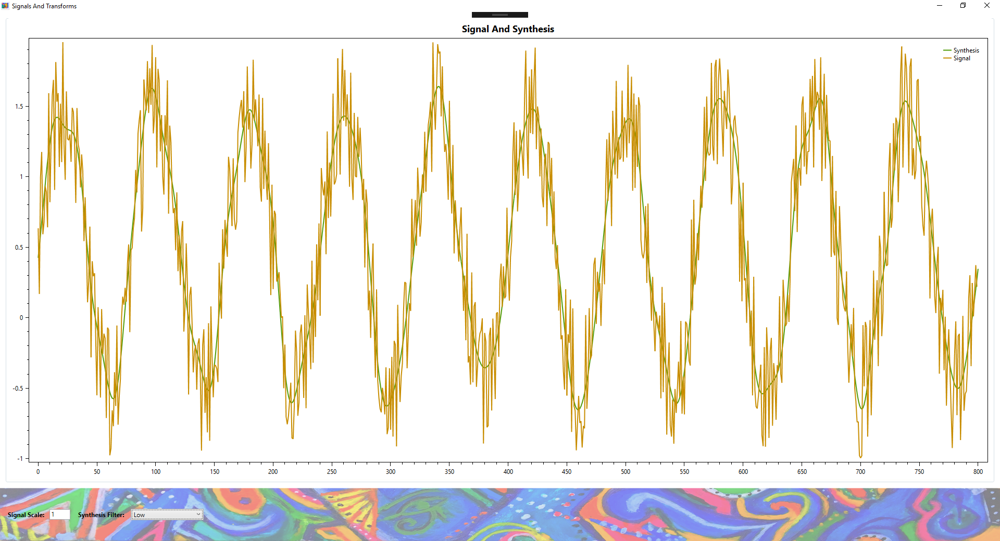

# Digital Signal Processing

Discreet Fourier Transform Implementation with filters and visualization.

In these examples a sample rate of 8000 samples/second was used on a 100hz sine wave (synthetic sample) with whitenoise added to the signal. Here we are looking at the first 100 milliseconds of the signal.

## High Pass Filter:

## Low Pass Filter:
Zoom in to see the smoother low frequency synthesized signal in the noisy original signal

